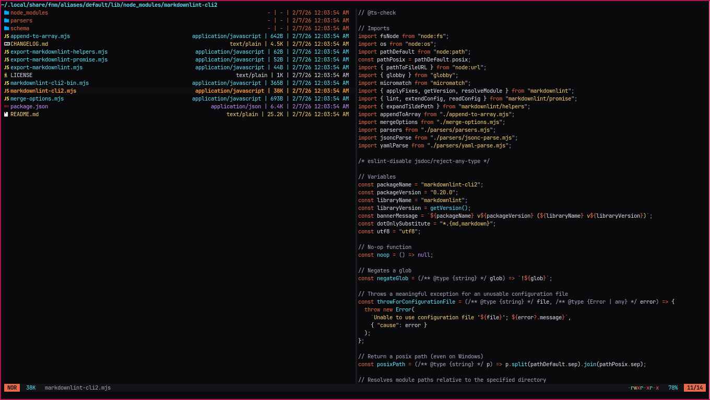
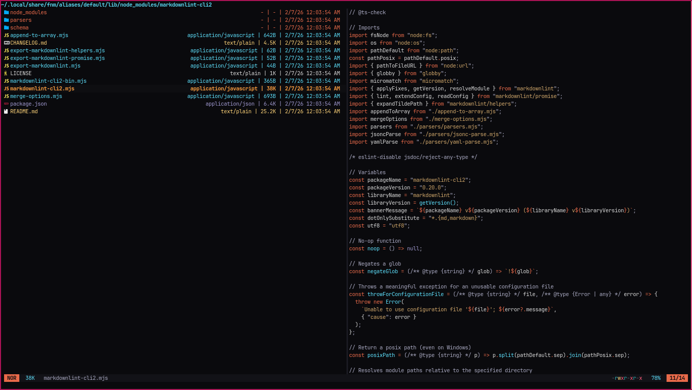

# yazi-flavors

A collection of custom [yazi flavors](https://yazi-rs.github.io/).

## Flavors

| [obsidian-glow](https://github.com/ZimCodes/yazi-flavors/tree/main/obsidian-glow.yazi) | [obsidian-soft-glow](https://github.com/ZimCodes/yazi-flavors/tree/main/obsidian-soft-glow.yazi) |
| -------------- | ------------------ |
|  |  |

## Installation

To install a flavor, review the README of the chosen flavor.

## License

All flavors and their tmtheme.xml here are licensed under [MIT](./LICENSE).
